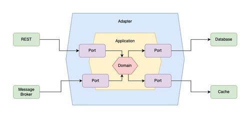

# Hexagonal Architecture

## Terminology

| Term            | Description                                                                                          |
|-----------------|------------------------------------------------------------------------------------------------------|
| **Port**        | Interface defining how the application communicates with the outside world.                          |
| **Adapter**     | Component implementing a port to connect external systems or technologies to the core.               |
| **Domain**      | Core business logic and rules, independent of external systems or frameworks.                        |
| **Application** | Layer that coordinates activities and orchestrates domain logic.                                     |
| **REST**        | External entity interacting with the application through an adapter using RESTful APIs.              |
| **Message Broker** | External entity communicating asynchronously with the application via an adapter for messaging.   |
| **Database**    | External entity responsible for data persistence and retrieval, accessed through an adapter.          |
| **Cache**       | External entity providing fast, temporary data storage, accessed through an adapter.                 |

## Why

### Introduction

#### Background

The need for Hexagonal Architecture arose from the challenges faced in traditional layered architectures, where business logic often became tightly coupled with external systems such as databases, user interfaces, or messaging platforms. This coupling made it difficult to adapt to changing requirements, replace technologies, or test the core logic in isolation. Hexagonal Architecture was introduced to address these issues by promoting a clear separation between the application's core logic and its external dependencies, enabling greater flexibility, maintainability, and testability.

#### Requirement

The application must be able to evolve independently of external systems, such as databases, APIs, or user interfaces. It should allow for easy replacement or modification of these external dependencies without impacting the core business logic. Testing the core logic in isolation is essential, requiring clear boundaries between the domain and infrastructure. The architecture should support maintainability, scalability, and adaptability to new requirements or technologies, ensuring that the system remains robust as it grows and changes.

### Goals

The main goals of using Hexagonal Architecture are:

- **Decoupling core logic from external systems:** Ensuring that the business logic remains independent of frameworks, databases, user interfaces, and other infrastructure concerns.
- **Improving testability:** Allowing the core application to be tested in isolation by substituting real external systems with mocks or stubs.
- **Enhancing maintainability and flexibility:** Making it easier to replace or modify external technologies without affecting the core logic.
- **Supporting scalability and adaptability:** Facilitating the evolution of the system to meet new requirements or integrate with new technologies with minimal impact on the core.
- **Promoting clear boundaries:** Defining explicit interfaces (ports) and adapters to manage interactions between the core and external components.

## What

Hexagonal Architecture, also known as the Ports and Adapters pattern, is a software design approach that structures an application so that its core business logic (the domain) is isolated from external systems and technologies. The architecture achieves this by defining clear interfaces, called ports, which specify how the application communicates with the outside world. Adapters implement these ports to connect the core logic to various external components, such as databases, user interfaces, REST APIs, or message brokers.

This separation allows the core logic to remain independent, making it easier to test, maintain, and evolve. External systems can be replaced or modified without affecting the business rules, and the application can adapt to new requirements or technologies with minimal changes to its core. Hexagonal Architecture promotes flexibility, scalability, and a clear boundary between the domain and infrastructure, resulting in more robust and adaptable software systems.

## Diagram

