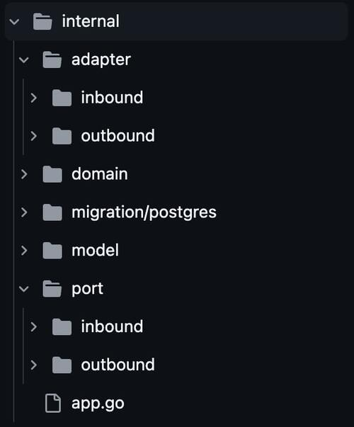

# Repository Structure



## Overview

The Go Boilerplate project follows hexagonal architecture (also known as ports and adapters) principles with a carefully designed internal repository structure. This document explains how the project's internal repository is organized and how the components interact with each other.

## Repository Structure

### Directory Organization

```
internal/
├── adapter/              # Implementations of ports (adapters)
│   ├── inbound/          # Adapters receiving requests into the application
│   │   ├── command/      # CLI command adapters
│   │   ├── fiber/        # HTTP Fiber framework adapters
│   │   └── rabbitmq/     # RabbitMQ consumer adapters
│   └── outbound/         # Adapters sending requests to external systems
│       ├── http/         # HTTP client adapters
│       ├── postgres/     # PostgreSQL database adapters
│       ├── rabbitmq/     # RabbitMQ producer adapters
│       └── redis/        # Redis cache adapters
├── domain/               # Core business logic
│   └── client/           # Client domain logic example
├── migration/            # Database migration scripts
│   └── postgres/         # PostgreSQL specific migrations
├── model/                # Data structures/entities
└── port/                 # Interface definitions
    ├── inbound/          # Inbound ports (for receiving requests)
    └── outbound/         # Outbound ports (for sending requests)
```

## Key Components

### Ports (Interfaces)

Located in the `internal/port/` directory, ports define the contracts for how the application communicates with the external world:

1. **Inbound Ports (`internal/port/inbound/`)**: Define how external systems communicate with the application.
   - HTTP interfaces (`registry_http.go`)
   - Message consumer interfaces (`registry_message.go`)
   - Command interfaces (`registry_command.go`)

2. **Outbound Ports (`internal/port/outbound/`)**: Define how the application communicates with external systems.
   - Database interfaces (`registry_database.go`)
   - HTTP client interfaces (`registry_http.go`)
   - Message producer interfaces (`registry_message.go`)
   - Cache interfaces (`registry_cache.go`)

### Adapters (Implementations)

Located in the `internal/adapter/` directory, adapters implement the ports:

1. **Inbound Adapters (`internal/adapter/inbound/`)**: 
   - `fiber/`: HTTP handlers using the Fiber framework
   - `rabbitmq/`: Message consumers using RabbitMQ
   - `command/`: CLI command handlers

2. **Outbound Adapters (`internal/adapter/outbound/`)**: 
   - `postgres/`: PostgreSQL database adapters
   - `http/`: HTTP client adapters for external APIs
   - `rabbitmq/`: Message producers using RabbitMQ
   - `redis/`: Cache adapters using Redis

### Domain Logic

Located in `internal/domain/`, this contains the core business logic of the application, independent from external systems. The domain layer uses ports to interact with external systems but isn't aware of the actual implementations (adapters).

### Models

Located in `internal/model/`, these are the data structures and entities used throughout the application. They represent the business objects and their attributes.

## How Components Interact

### Dependency Flow

The dependency flow follows the hexagonal architecture principle:

1. **Domain logic** depends on **ports** (interfaces)
2. **Adapters** implement these **ports**
3. The application wires everything together at startup

This ensures that the domain logic remains independent of the implementation details of external systems.

### Registry Pattern

The project uses a registry pattern to organize and access adapters:

1. Registry interfaces in port directory (`registry_*.go` files) define groups of related ports
2. Registry implementations in adapter directories handle the creation and management of adapter instances
3. The application uses these registries to access the appropriate adapters at runtime

## Component Creation Process

The project uses a Makefile to automate the creation of new components:

### Inbound Adapters

- `make inbound-http-fiber VAL=name`: Creates HTTP handler interfaces, adapters, and registry updates
- `make inbound-message-rabbitmq VAL=name`: Creates RabbitMQ consumer interfaces, adapters, and registry updates
- `make inbound-command VAL=name`: Creates command handler interfaces, adapters, and registry updates

### Outbound Adapters

- `make outbound-database-postgres VAL=name`: Creates database interfaces, adapters, and registry updates
- `make outbound-http VAL=name`: Creates HTTP client interfaces, adapters, and registry updates
- `make outbound-message-rabbitmq VAL=name`: Creates RabbitMQ producer interfaces, adapters, and registry updates
- `make outbound-cache-redis VAL=name`: Creates Redis cache interfaces, adapters, and registry updates

### Models and Migrations

- `make model VAL=name`: Creates model structure with basic fields
- `make migration-postgres VAL=name`: Creates PostgreSQL migration files

## Testing Strategy

The repository structure is designed to facilitate testing:

1. **Mocks**: Generated automatically for each port interface using `mockgen` (`make generate-mocks`)
2. **Unit Tests**: Test domain logic in isolation using mocks of the ports

## Benefits of This Structure

1. **Clear Separation of Concerns**: Domain logic is separate from infrastructure details
2. **Flexibility**: Easy to swap out adapters (e.g., switch from Postgres to MySQL)
3. **Testability**: Domain logic can be tested in isolation
4. **Maintainability**: Changes to one component don't affect others
5. **Consistency**: Standardized approach to adding new features
6. **Code Generation**: Repetitive boilerplate code can be generated using the Makefile targets

## Best Practices

1. **Keep Domain Logic Pure**: Domain logic should not depend on specific technologies or frameworks
2. **Use Interfaces Wisely**: Define clear interfaces between components
3. **Follow the Dependency Rule**: Dependencies should point inward toward the domain
4. **Generate Mocks**: Use `make generate-mocks` after creating new ports
5. **Automate Creation**: Use the provided Makefile targets to create new components consistently
